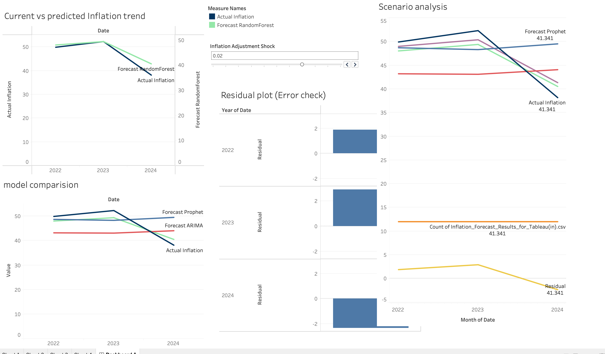

# Inflation-Forecasting-Decision-System

An end-to-end data science project implementing advanced statistical and machine learning models for time series forecasting, integrated with a high-fidelity interactive dashboard for executive insights.

## 📌 Project Overview
Traditional forecasting models often struggle with complex business data containing multiple seasonalities, sudden trend shifts, and external influences (exogenous factors). This project tackles these challenges by deploying robust data science models and serving the predictions through an interactive visualization layer.

The project is split into two major phases:
1. **The Machine Learning Pipeline:** Data preparation, feature engineering, model training, and back-testing validation.
2. **The Business Intelligence Layer:** Transforming complex statistical outputs (mean forecasts, residuals, and confidence intervals) into an intuitive dashboard to drive strategic decision-making.

## 📊 Dashboard Preview
Below is a preview of the interactive reporting layer showcasing the historical actuals, forecast trends, and prediction intervals.



## 🛠️ Tech Stack & Architecture

* **Data Engineering & Modeling (Backend):** Python, Pandas, NumPy, Scikit-Learn, Statsmodels, Meta Prophet, LightGBM / XGBoost.
* **Visualization & Analytics (Frontend):** Tableau Desktop / Web Architecture.
* **Storage/Integration:** CSV/SQL database endpoints containing final structured predictions.

---

## 📈 Advanced Forecasting Techniques Implemented

### 1. Statistical & Additive Modeling (Prophet & SARIMA)
* **Meta Prophet:** Chosen for its robust handling of non-linear trends with yearly, weekly, and daily seasonality, alongside holiday effects. It cleanly isolates structural breaks without manual data interpolation.
* **SARIMAX:** A classical autoregressive approach used to model stationary and non-stationary components while incorporating exogenous variables ($X$) to capture external market drivers.

### 2. Machine Learning Approaches (Gradient Boosting)
* **XGBoost / LightGBM:** Time series framed as a supervised learning task. 
* **Feature Engineering:** Creation of lag variables, rolling mean/variance windows, and Fourier terms to explicitly capture cyclic behavior.

---

## 🔍 Model Evaluation & Validation

To ensure corporate buy-in and algorithmic trust, the models are evaluated using rigorous cross-validation and back-testing against a dedicated historical holdout set.

### Performance Metrics
The dashboard tracks and displays the following key accuracy metrics:
* **MAE (Mean Absolute Error):** Measures average magnitude of errors.
* **RMSE (Root Mean Squared Error):** Penalizes larger variance and outliers.
* **MAPE (Mean Absolute Percentage Error):** Provides relative error scale for executive context.

### Residual Analysis
Residual components ($e_t = Y_t - \hat{Y}_t$) are tracked to confirm they behave as white noise—meaning they are normally distributed and randomly scattered around zero, proving that the models have extracted all usable signal from the data.

---

## 📁 Repository Structure

```text
├── notebook/               # Jupyter notebooks for data cleaning, EDA, and model training
├── data/                   # Raw, processed, and final prediction datasets
├── assets/                 # Images, icons, and dashboard screenshots (Tableau)
└── README.md               # Project documentation
